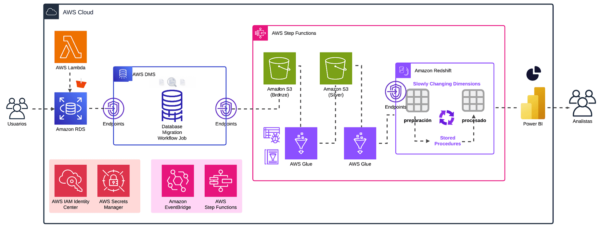
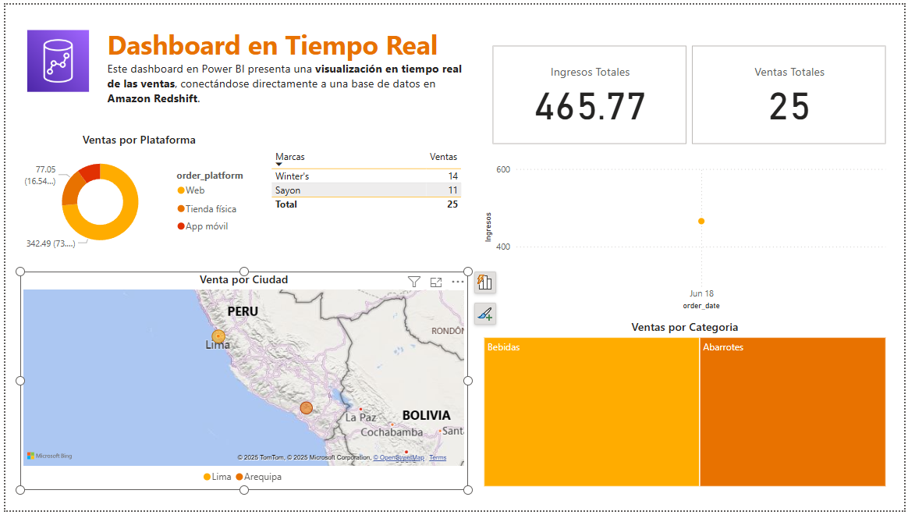

# 🛠️ AWS Data Ingestion Pipeline - Real-Time Architecture

Este repositorio contiene el código y scripts necesarios para implementar un pipeline de ingesta de datos en AWS utilizando servicios como Amazon RDS, AWS DMS, AWS Glue, Amazon Redshift y Power BI. La solución está diseñada para permitir una carga y transformación eficiente de datos con manejo de cambios mediante Slowly Changing Dimensions (SCD Tipo 2).

## 🧱 Arquitectura General





### Componentes Clave

- **Amazon RDS**: Origen de los datos (base de datos transaccional).
- **AWS Lambda**: Automatiza disparadores para procesos de migración.
- **AWS DMS**: Realiza la migración de datos de RDS hacia S3.
- **Amazon S3 (Bronze / Silver)**: Almacenamiento por capas de datos sin procesar y parcialmente transformados.
- **AWS Glue**: Realiza transformaciones ETL sobre los datos.
- **Amazon Redshift**: Almacén de datos donde se ejecutan Stored Procedures con lógica SCD Tipo 2.
- **AWS Step Functions**: Orquestación de los procesos ETL.
- **Power BI**: Conectado a Redshift para visualización analítica.

---

## 📁 Estructura del Repositorio

```bash
aws-data-ingestion-restart/
│
├── assets/
│   └── aws_architecture.gif          # Diagrama animado de la arquitectura
│
├── glue-jobs/
│   ├── load_jobs/
│   │   └── data-engineering-project-load-orders_job.py
│   └── transform_jobs/
│       ├── raw_customer_etl_job.py
│       ├── raw_orderdetails_etl_job.py
│       ├── raw_orders_etl_job.py
│       └── raw_product_etl_job.py
│
├── lambda-function/
│   └── lambda_function.py
│
├── rds/
│   └── mysql_source_ddl.sql
│
├── redshift/
│   ├── DDL/
│   │   ├── customer_setup_sql.sql
│   │   ├── mv_sales_mart.sql
│   │   ├── order_details_setup_sql.sql
│   │   ├── orders_setup_sql.sql
│   │   ├── products_setup_sql.sql
│   │   └── schema_database.sql
│   └── SP/
│       ├── customer_dim_sp.sql
│       └── products_dim_sp.sql
│
├── step-functions/
│   └── MyStateMachine.json
│
├── README.md
└── README.mdgit
```

---

## ⚙️ Cómo desplegar

1. **Configurar RDS y cargar esquema fuente**  
   Ejecutar el script `mysql_source_ddl.sql` en una instancia MySQL de Amazon RDS.

2. **Migrar datos con AWS DMS**  
   Crear endpoints de origen y destino, y configurar el *Database Migration Workflow Job*.

3. **Cargar datos a S3 y transformarlos**  
   Ejecutar los Glue Jobs en `glue-jobs/` para las capas Bronze y Silver.

4. **Crear estructura en Redshift**  
   Usar los scripts de `redshift/DDL` para crear tablas y vistas necesarias.

5. **Aplicar lógica SCD**  
   Ejecutar los Stored Procedures en `redshift/SP`.

6. **Visualizar en Power BI**  
   Conectar Power BI a Amazon Redshift para reportes y dashboards.

---

## 🧠 Tecnologías Utilizadas

- **AWS DMS**
- **AWS Lambda**
- **AWS Glue**
- **Amazon S3**
- **Amazon Redshift**
- **AWS Step Functions**
- **AWS EventBridge**
- **Power BI**

---

## 📊 Caso de Uso

Esta arquitectura permite a los analistas de datos tener una vista consolidada y actualizada de datos operacionales, con trazabilidad histórica gracias a la implementación de Slowly Changing Dimensions (Tipo 2).

---

## ✍️ Autor

**Cesar Atachao**  
Ingeniero de Sistemas | Cloud & Data Engineering Enthusiast
